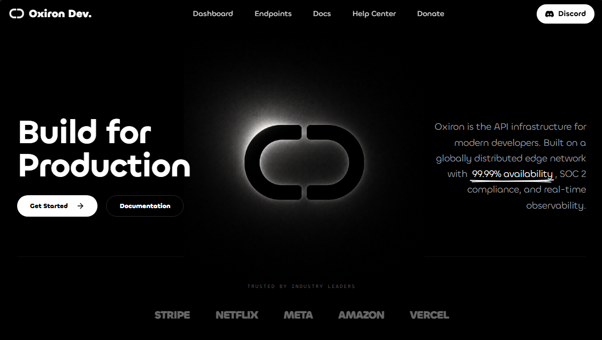
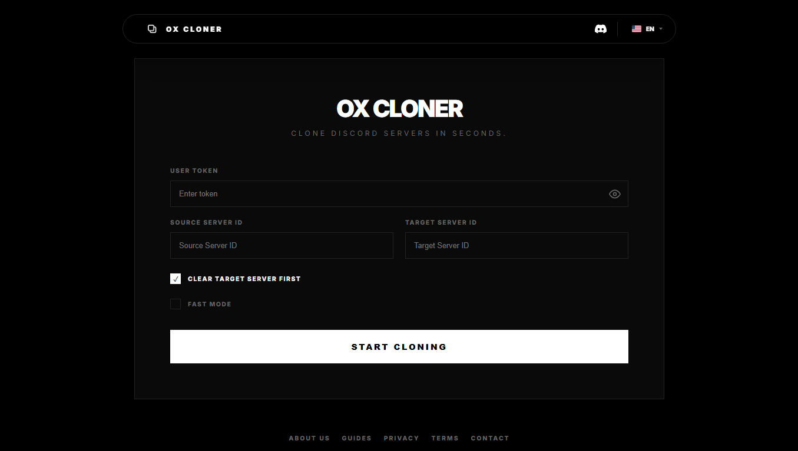

  

  

    
    
    
  

 

  <table width="100%">
    <tr>
      <td align="center" style="background: #0d1117; border: 1px solid #30363d; border-radius: 12px; padding: 24px; box-shadow: 0 4px 30px rgba(0, 0, 0, 0.4); max-width: 800px;">
        <h3>ᴀʙᴏᴜᴛ ᴍᴇ</h3>
        

          Hi! I'm <b>nuekkis</b>, a developer with a passion for building high-quality, secure, and beautiful software. I focus on blending aesthetics with technical power, writing clean code, and solving complex architectural challenges.
        

        

          So, what do I do besides coding? I love tinkering with new technologies, participating in open-source projects, and sharing knowledge with fellow developers. In my spare time, you'll find me grabbing a coffee, watching science-fiction movies, or listening to music.
        

         
        

          
          
          
        

      </td>
    </tr>
  </table>

 

  <h2>ᴛᴇᴄʜ ꜱᴛᴀᴄᴋ</h2>
   
  

    
  

 

  <h2>ꜰᴇᴀᴛᴜʀᴇᴅ ᴘʀᴏᴊᴇᴄᴛꜱ</h2>
   
  
  <table width="100%" border="0" cellpadding="0" cellspacing="0">
    <tr>
      <td width="50%" valign="top">
        

          

            
            <h3 style="margin: 12px 0 6px 0; text-align: center;">
              <a href="https://github.com/nuekkis" style="text-decoration: none; color: #F75C7E; font-weight: bold; font-size: 18px;">Oxiron API</a>
            </h3>
            

              A fast, modular, and secure API framework built for scalable backend services with clean developer ergonomics.
            

        

      </td>
      <td width="50%" valign="top">
        

          

            
            <h3 style="margin: 12px 0 6px 0; text-align: center;">
              <a href="https://github.com/Oxiron-Development/OX-Cloner" style="text-decoration: none; color: #F75C7E; font-weight: bold; font-size: 18px;">OX Cloner </a>
            </h3>
            

              Copy the source server specified by its ID to the target server using the Discord user account token.
            

        

      </td>
    </tr>
  </table>

 

  <h2>ᴅᴇᴠᴇʟᴏᴘᴇʀ ᴀɴᴀʟʏᴛɪᴄꜱ</h2>
   

  

    
    
  

 
 

  
     
  
    
  
<em>Designed with ♥️ by nuekkis</em>

