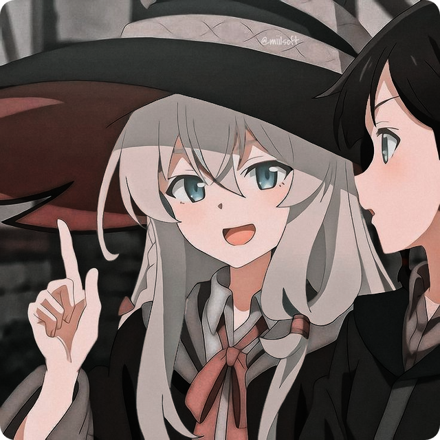

  

  
  
  

 

<table align="center" border="0" cellpadding="0" cellspacing="0" width="100%">
  <tr>
    <td width="60%" valign="top">
      <h2>🚀 Hakkımda / About Me</h2>
      

        Selam! Ben <b>nuekkis</b>, teknolojiyi estetikle harmanlamayı, yaratıcı ve kullanıcı dostu projeler geliştirmeyi seven tutkulu bir yazılımcıyım. Her projede temiz kod yazmak, karmaşık sorunları çözmek ve sınırlarımı zorlamak en büyük motivasyon kaynağım.
      

      

        Hi! I'm <b>nuekkis</b>, a developer with a passion for software. I love blending technology with aesthetics, crafting clean code, and pushing myself to tackle complex problems.
      

       
      

        <b>🌱 Kişisel Bilgiler / Quick Facts:</b>
      

      <ul>
        <li>🎂 <b>Yaş / Age:</b> 17</li>
        <li>📍 <b>Konum / Location:</b> İzmir, Türkiye 🇹🇷</li>
        <li>♂️ <b>Zamirler / Pronouns:</b> He / Him</li>
        <li>🎮 <b>Hobiler / Hobbies:</b> Kodlama, Müzik, Anime, Oyunlar, Futbol</li>
      </ul>
    </td>
    <td width="5%"></td>
    <td width="35%" align="center" valign="middle">
      
    </td>
  </tr>
</table>

 
 

  <h2>💻 Teknolojiler / Tech Stack</h2>
  
  

    
    
    
    
    
    
  

  
  

    
    
    
    
    
    
  

  
  

    
    
    
    
    
  

  
  

    
    
    
    
    
  

 
 

  <h2>🌟 Öne Çıkan Projeler / Featured Projects</h2>
  
  <table width="100%" border="0" cellpadding="0" cellspacing="0">
    <tr>
      <td width="50%" valign="top">
        

          
          

            <h3 style="margin: 10px 0 6px 0; text-align: center;">
              <a href="https://github.com/nuekkis" style="text-decoration: none; color: #F75C7E; font-weight: bold;">Slayer Bot 🤖</a>
            </h3>
            

              Sohbet edebileceğiniz ve resim çizdirebileceğiniz, kapsamlı ve geniş komut yelpazesi sunan gelişmiş bir Discord yapay zeka, eğlence ve moderasyon botu.
            

          

        

      </td>
      <td width="50%" valign="top">
        

          
          

            <h3 style="margin: 10px 0 6px 0; text-align: center;">
              <a href="https://github.com/nuekkis" style="text-decoration: none; color: #F75C7E; font-weight: bold;">PigeonMC 🐦</a>
            </h3>
            

              Basit kullanımıyla düşük donanımlı makinalar için optimize edilmiş, yüksek performanslı, C++ tabanlı, kullanıcı dostu Minecraft sunucu yazılımı.
            

          

        

      </td>
    </tr>
  </table>

 
 

  <h2>📦 NPM Paketlerim / NPM Packages</h2>

- 🛡️ **[GuOx-Express](https://npmjs.com/package/guox-express)**  
  - **GuOx**, sıfır güven ortamları, gerçek zamanlı tehdit azaltma ve ölçeklenebilir güçlendirme stratejileri için tasarlanmış, **Express.js için** üst düzey, modüler bir **güvenlik çerçevesidir**.
- 🗄️ **[GrokDB](https://npmjs.com/package/grokdb)**  
  - **GrokDB**, **Node.js uygulamaları için** yüksek performanslı, güvenli ve özellik açısından zengin bir **SQLite veritabanı sarmalayıcısıdır**. better-sqlite3 tabanlı, modern ve tür güvenli API sunar.
- 🎵 **[SetMusic](https://npmjs.com/package/setmusic)**  
  - **SetMusic**, **Discord için** modüler ve ultra özellikli bir **müzik bot kütüphanesidir**. Herhangi bir komut veya yerleştirme yapısı gerektirmeden gelişmiş ses kontrol API'si sunar.

 
 

  <h2>📊 İstatistikler / GitHub Stats</h2>
  
  

    
    
  

  
  

    
  

  
  

    
  

 
 

  <h2>💬 Canlı Durum & İlham / Live Status & Inspiration</h2>
  
  

    
  

  

    
  

 

  
<b>🎭 Sevdiğim Sözler / Creative Quotes</b>

   
  <blockquote>
    
<i>"İki şey sonsuzdur: evren ve insan aptallığı; ve ben evrenden emin değilim."</i> <b>~ Albert Einstein</b>

  </blockquote>
  <blockquote>
    
<i>"Cesaret, korkusuzluk değil, korkuya rağmen ilerleyebilmektir."</i> <b>~ Nelson Mandela</b>

  </blockquote>
  <blockquote>
    
<i>"Eğer hayal edebiliyorsanız, başarabilirsiniz."</i> <b>~ Walt Disney</b>

  </blockquote>

 
 

  <h3>🎮 Snake Contribution Game</h3>
  

 

  
  
<em>Designed with ♥️ by nuekkis & Antigravity</em>

