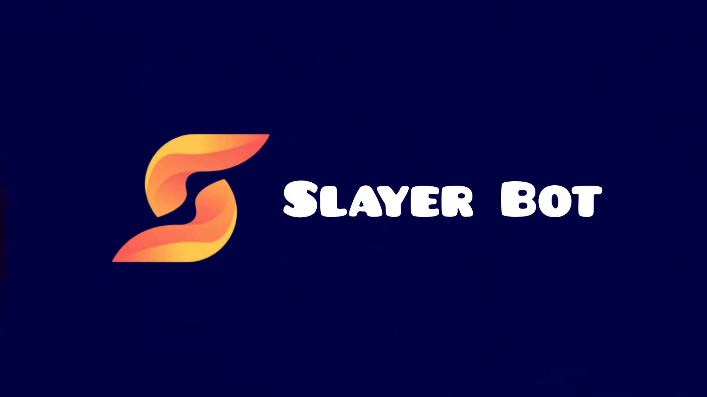
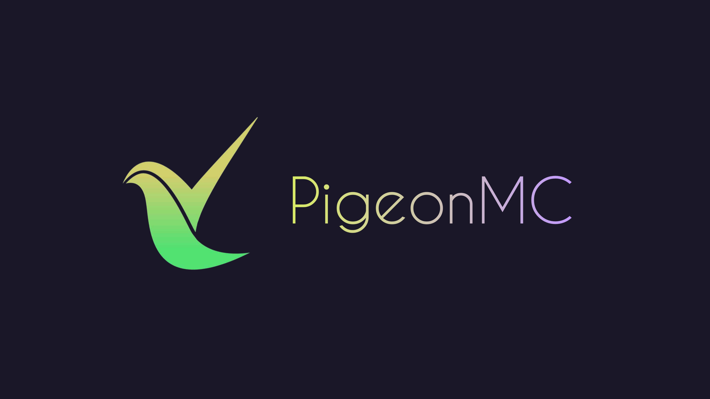

  

  

    
    
    
  

 

  <table width="100%">
    <tr>
      <td align="center" style="background: #0d1117; border: 1px solid #30363d; border-radius: 12px; padding: 24px; box-shadow: 0 4px 30px rgba(0, 0, 0, 0.4); max-width: 800px;">
        <h3>📖 About Me</h3>
        

          Hi! I'm <b>nuekkis</b>, a developer with a passion for building high-quality, secure, and beautiful software. I focus on blending aesthetics with technical power, writing clean code, and solving complex architectural challenges.
        

        

          So, what do I do besides coding? I love tinkering with new technologies, participating in open-source projects, and sharing knowledge with fellow developers. In my spare time, you'll find me grabbing a coffee, watching science-fiction movies, or listening to music.
        

         
        

          
          
          
          
        

      </td>
    </tr>
  </table>

 
 

  <h2>💻 Tech Stack</h2>
   
  
  

    
    
    
    
    
  

  
  

    
    
    
    
    
  

  
  

    
    
    
    
    
    
  

  
  

    
    
    
    
    
    
  

 
 

  <h2>🌟 Featured Projects</h2>
   
  
  <table width="100%" border="0" cellpadding="0" cellspacing="0">
    <tr>
      <td width="50%" valign="top">
        

          

            
            <h3 style="margin: 12px 0 6px 0; text-align: center;">
              <a href="https://github.com/nuekkis" style="text-decoration: none; color: #F75C7E; font-weight: bold; font-size: 18px;">Slayer Bot 🤖</a>
            </h3>
            

              An advanced Discord AI, entertainment, and moderation bot featuring image generation and conversational chat capabilities.
            

          

          

            
            
            
          

        

      </td>
      <td width="50%" valign="top">
        

          

            
            <h3 style="margin: 12px 0 6px 0; text-align: center;">
              <a href="https://github.com/nuekkis" style="text-decoration: none; color: #F75C7E; font-weight: bold; font-size: 18px;">PigeonMC 🐦</a>
            </h3>
            

              A high-performance, C++ based, user-friendly Minecraft server software optimized for low-end machines.
            

          

          

            
            
            
          

        

      </td>
    </tr>
  </table>

 
 

  <h2>📦 NPM Packages</h2>
   

  <table width="100%">
    <tr>
      <td style="padding: 10px 0;">
        🛡️ <b><a href="https://npmjs.com/package/guox-express" style="color: #F75C7E; text-decoration: none;">GuOx-Express</a></b> 
         
        
        

          A modular, enterprise-grade security framework designed for Express.js, featuring zero-trust environments and real-time threat mitigation.
        

      </td>
    </tr>
    <tr>
      <td style="padding: 10px 0; border-top: 1px solid #21262d;">
        🗄️ <b><a href="https://npmjs.com/package/grokdb" style="color: #F75C7E; text-decoration: none;">GrokDB</a></b> 
         
        
        

          A high-performance, secure, and type-safe SQLite database wrapper for Node.js applications, powered by better-sqlite3.
        

      </td>
    </tr>
    <tr>
      <td style="padding: 10px 0; border-top: 1px solid #21262d;">
        🎵 <b><a href="https://npmjs.com/package/setmusic" style="color: #F75C7E; text-decoration: none;">SetMusic</a></b> 
         
        
        

          A modular, ultra-featured music bot library for Discord, providing rich playback APIs, advanced audio filters, and queue management.
        

      </td>
    </tr>
  </table>

 
 

  <h2>📊 Developer Analytics</h2>
   
  
  <table width="100%" border="0" cellpadding="0" cellspacing="0">
    <tr>
      <td width="58%" align="center" valign="top">
        
      </td>
      <td width="42%" align="center" valign="top">
        
      </td>
    </tr>
    <tr>
      <td colspan="2" align="center" style="padding-top: 14px;">
        
      </td>
    </tr>
    <tr>
      <td colspan="2" align="center" style="padding-top: 14px;">
        
      </td>
    </tr>
  </table>

 
 

  <h2>💬 Live Status & Inspiration</h2>
   
  
  

    &nbsp;&nbsp;&nbsp;&nbsp;&nbsp;&nbsp;&nbsp;&nbsp;&nbsp;&nbsp;&nbsp;&nbsp;&nbsp;&nbsp;&nbsp;&nbsp;&nbsp;&nbsp;&nbsp;&nbsp;&nbsp;&nbsp;&nbsp;&nbsp;&nbsp;&nbsp;&nbsp;&nbsp;&nbsp;&nbsp;&nbsp;&nbsp;&nbsp;&nbsp;&nbsp;&nbsp;&nbsp;&nbsp;&nbsp;&nbsp;&nbsp;&nbsp;&nbsp;&nbsp;&nbsp;&nbsp;&nbsp;&nbsp;&nbsp;&nbsp;&nbsp;
    
  

 

  <h3>🎭 Favorite Quotes</h3>
   
  <blockquote>
    
<i>"Two things are infinite: the universe and human stupidity; and I'm not sure about the universe."</i> <b>~ Albert Einstein</b>

  </blockquote>
  <blockquote>
    
<i>"Courage is not the absence of fear, but rather the judgement that something else is more important than fear."</i> <b>~ Nelson Mandela</b>

  </blockquote>
  <blockquote>
    
<i>"If you can dream it, you can do it."</i> <b>~ Walt Disney</b>

  </blockquote>

 
 

  
     
  
    
  
<em>Designed with ♥️ by nuekkis</em>

